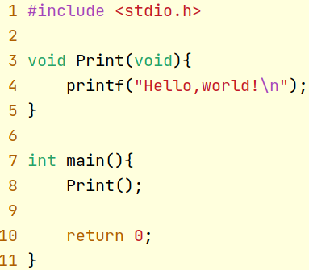
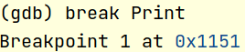
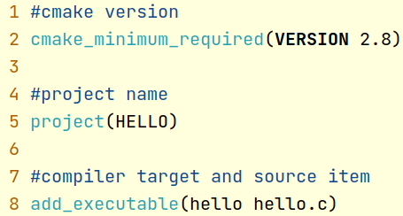
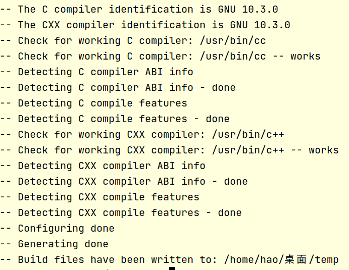

# Lab0 Software Setup (English version)

### Overview

This course generally includes 4 experiments, each of which has a period of 2 weeks, that is, you need to submit an experiment report within 2 weeks after the experiment is set up.

This document is a description of the installation of the experimental environment for this course . In order to reduce errors otherthan the experiment, please refer to the instructions in the document to configure the required experiment environment on your computer.

### Part A: Ubuntu

All experiments in this course are required to be completed on a Linux system. If you are a Windows or Mac OS user, please refer to the following steps to install a Linux virtual machine:

1. Download the Ubuntu system image: It is recommended to use a stable release version. We recommend that you install Ubuntu18 or above. You can visit the official Ubuntu website (https://ubuntu.com/download/desktop) to download the system mirror, or visit the domestic mirror website (http://mirrors.163.com/ubuntu-releases/) to download the system mirror. Generally speaking, the download speed of the latter is more fast;

2. Install VMware or VirtualBox on your computer: Both software can be used to install and manage your virtual machine system. For VMware software, please refer to (https://zhuanlan.zhihu.com/p/141033713) to install Ubuntu image; for VirtualBox software, please refer to (https://blog.csdn.net/weixin_44813579/article/details/105867198) to install Ubuntu image.

### Part B:

#### 1.1 GCC

GCC is a free software released under the GPL license and is also a key part of the GNU project. The original intention of GCC was to write a compiler for the GNU operating system, and it has been adopted as a standard compiler by most Unix-like operating systems (such as Linux, BSD, MacOS X, etc.). For more detailed information about GCC, you can read its official documentation (https://gcc.gnu.org/onlinedocs/).

#### 1.2 Install GCC

(1) Enter the command in the terminal: **sudo apt-get install gcc**, you can install the GCC compiler;

(2) Enter the command in the terminal: **gcc --version**, when the GCC version information is printed out, the installation is successful;

#### 1.3 Quick start

The following demonstrates the simple usage of the GCC compiler, you can read the official documentation for more usage:

(1) Use vim (or other editors) to write the hello.c program as shown below:

(2) Enter the command in the terminal: **gcc hello.c -o hello**, the source file can be compiled into an executable file with the specified file name hello in green color, As follows:

(3) hello is a compiled executable file. Enter the command: **./hello** in the terminal to run the program.

#### 1.4 Exercise 

The compilation process includes preprocessing, compilation and linking. You can view the files generated by each process by modifying the parameters of gcc. Please use the above demo program hello.c as the source code, check the information, explain the function of the parameters "-E", "-c" and "-o" in gcc, and write down the suffix of the the file name which will be generated at each step.

#### 2.1 GDB 

GDB is an excellent command line debugging tool on UNIX and UNIX-like systems. By using GDB, you can debug the program and check various system data such as variables, registers, and memory status during the running of the program. For more detailed information of GDB, you can read its official documentation (https://www.gnu.org/software/gdb/documentation/).

#### 2.2 Install GDB

(1) Open the terminal and enter the command: **sudo apt-get install gdb**, you can install the GDB debugging tool;

(2) Enter the command in the terminal: **gdb --version**. When the GDB version is printed out, the installation is successful.

#### 2.3 Quick start

The following demonstrates the simple usage of GDB, you can read the official documentation for more usage:

(1) Take the hello.c of the above GCC part as the source code, and compile the executable file hello through gcc;

(2) The debugging object of GDB is the executable file hello instead of the source code. Enter the command: **gdb hello** in the terminal to start the gdb debugging process;

(3) Enter "**break**" or the abbreviation "**b**" in GDB, followed by a sentence, to tag a break point. Here we give a break to the Print function: "**break Print**". As shown below:

(4) Enter the command "**run**" to run the program in GDB. It can be found that the program execution is suspended at the breakpoint. As shown below:

(5) Input the command "**continue**" or the abbreviation "**c**" to let the program continue to run. Enter the command "**quit**" to exit the GDB debugging interface.

#### 2.4 Exercise

GDB has very rich functions. With the hello file as the debugging object, you can try other more commands, such as list, start, set, next, or step and so on. please describe your observations.

#### 3.1 cmake

CMake is a cross-platform installation (compilation) tool, you can use simple sentences to describe the installation (compilation) process of all platforms. In this course, you need to manually write CMake files in CLion. For more detailed content of CMake, you can read its official documentation (https://cmake.org/documentation/).

#### 3.2 Install cmake

There are many ways to install cmake on Linux. You can enter the command in the terminal: **sudo apt-get install cmake**, and follow the prompts to install cmake. Enter the command "**cmake**

**--version**" to check if you have installed sucessfully.

#### 3.3 Quick start

Let us take the source program hello.c in the above GCC part as the object to demonstrate the simple use of cmake.

(1) In the same directory, write the **CMakeLists.txt** file, which describes the compilation process. As follows:

(2) Enter the command: "**cmake .**" in the terminal to generate a Makefile. As follows:

(3) Enter the command "**make**" in the terminal, and you can observe the compilation process, result in generating the executable program hello.

#### 3.4 Exercise

You should write the Print function as an independent source file print.c and call it in hello.c. How to modify the CMakeList.txt file to achieve compilation successfully at this time? Write down your changes and describe your observation.

#### 4.1 CLion IDE

CLion is a cross-platform IDE (Intergrated development environment) designed for C/C++. It contains many intelligent functions, such as error prompts, code completion, automatic generation of makelist files, etc., which greatly improves Developer productivity.

#### 4.2 Install CLion

Since CLion is a paid software, before the installation,we recommend  you go to the official website of CLion (https://account.jetbrains.com/login) and use your USTC email to register an accountant. This will give you a one-year of CLion Professional Edition Eligibility for free use.

On the ubuntu system, you have multiple ways to install CLion. We give 3 ways, just choose the one that suits you for reference. We recommend using method one, which is the easiest.

**Method 1**: Use ubuntu's built-in application store (ubuntu software store) to download and install, search for CLion, and download it;

**Method 2**: Install CLion through the terminal. Enter the command "**sudo snap install clion --classic**" in the terminal and follow the prompts to install.

**Method 3**:

(1) Download the installation package file from the CLion official website (https://www.jetbrains.com/clion/download/#section=linux);

(2) Enter the command in the terminal to create a new directory for installing CLion in this directory, such as: "**sudo mkdir /opt/clion**";

(3) Decompress the downloaded compressed file to the /opt/clion directory. Enter the command in the terminal: "**sudo tar -zxvf CLion-2020.1.1.tar.gz -C /opt/clion**";

(4) Start CLion. Enter the command in the terminal: "**sh /opt/clion/clion-2020.1.1/bin/clion.sh**" to start.

#### 4.3 Quick start

You can visit the tutorial given on its official website (https://www.jetbrains.com/zh-cn/clion/learn/) to quickly get started with CLion, an excellent IDE.

# Lab0	Software Setup (Chinese version)

### Overview

本课程一般包含4次课后实验，每次实验周期为2周，即你需要在实验布置后的2周内上交实验报告。

本文档为课程《工程化C程序设计》实验环境安装之说明。为减少实验以外的错误，请参考说明文档的步骤在你的计算机上配置要求的实验环境。

### Part A: Ubuntu

本课程所有实验均要求在Linux系统上完成，如果你是Windows或Mac OS用户，请参考下面的步骤安装Linux虚拟机：

1，下载Ubuntu系统镜像：推荐使用稳定的发行版本，我们建议你安装Ubuntu18及以上版本。你可以访问Ubuntu官网（https://ubuntu.com/download/desktop）下载系统镜像，或是访问国内镜像网站（http://mirrors.163.com/ubuntu-releases/）下载系统镜像。一般来说，后者的下载速度更快；

2，在你的计算机上安装VMware或VirtualBox：这两款软件均可以用来安装和管理你的虚拟机系统。VMware软件请参考（https://zhuanlan.zhihu.com/p/141033713）安装Ubuntu镜像；VirtualBox软件请参考（https://blog.csdn.net/weixin_44813579/article/details/105867198）安装Ubuntu镜像。

### Part B: 

#### 1，GCC工具说明

GCC是以GPL许可证所发行的自由软件，也是GNU计划的关键部分。GCC的初衷是为GNU操作系统专门编写一款编译器，现已被大多数类Unix操作系统（如Linux、BSD、MacOS X等）采纳为标准的编译器。有关GCC更详细的内容，可以阅读其官方文档（https://gcc.gnu.org/onlinedocs/）。

#### 2，安装GCC

（1）在终端中输入指令：sudo apt-get install gcc，即可安装GCC编译器；

（2）在终端中输入指令：gcc --version，当打印出GCC版本信息时，说明安装成功；

#### 3，GCC使用快速上手

下面演示GCC编译器的简单使用方法，你可以阅读官方文档以获取更多使用方法：

（1）使用vim（或其他编辑器）编写hello.c程序如下所示：

（2）在终端中输入指令：gcc hello.c -o hello，即可将源文件编译成指定文件名hello的可执行文件。如下所示：

（3）hello是编译后的可执行文件，在终端中输入指令：./hello，即可运行该程序。

#### Exercise 1 

编译的过程包括预处理、编译和链接。你可以通过修改gcc的参数查看每一个过程生成的文件。请以上面的demo程序hello.c为源码，查阅资料，说明gcc中的参数“-E”、“-c”和“-o”的作用，并描述每一步会生成什么后缀的文件。

#### 1，GDB工具说明

GDB时UNIX及UNIX-like系统上的一款优秀的命令行调试工具。通过使用GDB，你可以对程序进行调试，并检查项目运行过程中系统的各项数据，如变量、寄存器和内存状态等。有关GDB更详细的内容，可以阅读其官方文档（https://www.gnu.org/software/gdb/documentation/）。

#### 2，安装GDB

（1）打开终端并输入指令：sudo apt-get install gdb，即可安装GDB调试工具；

（2）在终端中输入指令：gdb --version，当打印出GDB版本时，说明安装成功。

#### 3，GDB快速上手

下面演示GDB的简单使用方法，你可以阅读官方文档以获取更多使用方法：

（1）以上述GCC部分的hello.c为源码，通过gcc编译获得可执行文件hello；

（2）GDB的调试对象为可执行文件hello。在终端中输入指令：gdb hello，即可进入gdb调试界面；

（3）在GDB中输入“break”或缩写“b”，后接语句，可实现打断点。这里我们给Print函数打断点：“break Print”。如下图所示：

（4）输入指令“run”，在GDB中运行该程序。可发现，在断点处，程序暂停执行。如下图所示：

（5）输入指令“continue”或缩写“c”，即可让程序继续运行。输入指令“quit”即可退出GDB调试界面。

#### Exercise 2 

GDB的功能非常丰富，以hello文件为调试对象，你可以尝试其他更多指令，如list，start，set，next和step等。

#### 1，cmake工具说明

CMake是一个跨平台的安装（编译）工具，可以用简单的语句来描述所有平台的安装（编译过程）。本课程中需要你在CLion中手动编写CMake文件。有关CMake更详细的内容，可以阅读其官方文档（https://cmake.org/documentation/）。

#### 2，安装cmake

在Linux上有多种方式可以实现cmake的安装。你可以在终端中输入指令：sudo apt-get install cmake，并按照提示安装cmake。输入指令“cmake

--version”，出现版本号则说明安装成功。

#### 3，cmake快速上手

以GCC部分中的源程序hello.c为对象，演示cmake的简单使用方法。

（1）在同一目录下，编写CMakeLists.txt文件，该文件描述编译过程。如下所示：

（2）在终端中输入指令：“cmake .”，生成Makefile文件。如下所示：

（3）终端中输入指令“make”，可以观察到编译过程。并生成可执行程序hello。

#### Exercise 3

将Print函数写作独立的源文件print.c，在hello.c中调用。此时如何修改CMakeList.txt文件实现编译？写出你的修改内容，并观察运行结果。

#### 1，CLion IDE

CLion是Jetbrains推出的一款专为C/C++所设计的跨平台集成开发环境（IDE，intergrated development environment），包含许多智能功能，如错误提示、代码补全、自动生成makelist文件等，大大提高了开发人员的工作效率。

#### 2，安装CLion

由于CLion是一款付费软件，在正式安装前，你可以进入CLion官网（https://account.jetbrains.com/login），并使用科大邮箱进行注册，这可以使你获得一年的CLion专业版免费使用资格。

在ubuntu系统上，你有多种方式来安装CLion。我们给出3种方式，选择一种合适你的进行参考即可。我们推荐使用方法一，它最简单。

方式一：使用ubuntu内置的应用商城（ubuntu software store）进行下载安装，搜索CLion，并下载即可；

方式二：通过终端安装CLion。在终端中输入命令“sudo snap install clion --classic”，并按照提示进行安装即可。

方式三：

（1）在CLion官网（https://www.jetbrains.com/clion/download/#section=linux）下载安装包文件；

（2）在终端中输入命令，创建一个新的目录，用于将CLion安装在该目录下，如：“sudo mkdir /opt/clion”；

（3）将下载好的压缩文件解压至/opt/clion目录下。在终端中输入命令：“sudo tar -zxvf CLion-2020.1.1.tar.gz -C /opt/clion”；

（4）启动CLion。在终端中输入命令：“sh /opt/clion/clion-2020.1.1/bin/clion.sh”即可启动。

#### 3，CLion快速上手

你可以访问其官网中给出的教程（https://www.jetbrains.com/zh-cn/clion/learn/）快速上手CLion这款优秀的IDE。

